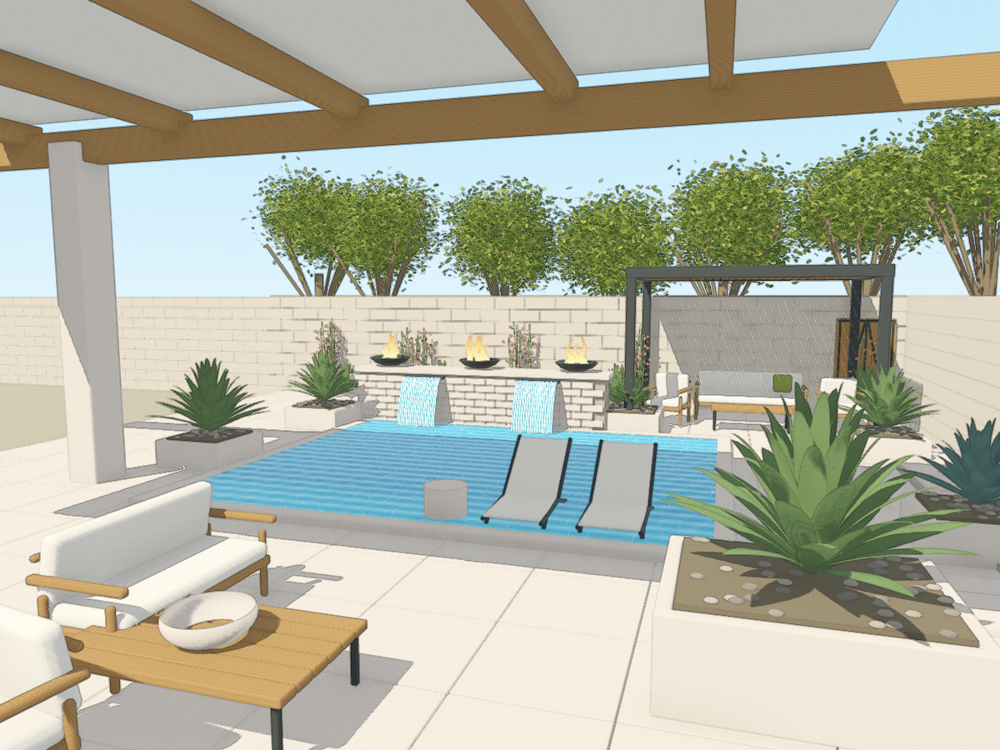

# Blender–Godot Astra Lab

A backyard courtyard study authored in Blender and rendered in Godot. The visual target is a supplied architectural illustration: warm limestone and timber, a turquoise pool, twin waterfalls, fire bowls, a furnished pergola, and desert planting.

**Godot is the final rendering target.** This is a working first style study, not a finished match to the reference. Vegetation, furniture, water realism, and composition still need refinement.

> The navigation/review and water-interaction continuations are **Technical only** pending a desktop Godot run.
> Version/GPU validation below describes the existing baseline, not a new validation of this branch.



## Open and run

1. Use **Godot 4.7.1 or newer**. The project was validated with 4.7.1 and the Forward+ Vulkan renderer on an NVIDIA RTX 3070 Ti Laptop GPU.
2. Import `godot/project.godot` into Godot and allow the assets to import.
3. Open `godot/courtyard_editable.tscn` to inspect or edit the scene.
4. Press **F6** to run that scene or **F5** to run the project.

The saved scene contains the meshes, lights, camera, and material overrides. Blender is not required to run it. The illustration contour effect requires Forward+; the mobile Compatibility setting is not the validated visual target.

| Control | Action |
| --- | --- |
| Right mouse drag | Orbit without crossing the camera poles |
| Mouse wheel | Zoom, clamped to a 2–45 unit orbit distance |
| R | Reset the reference camera |
| I | Toggle both the contours and paper finish |
| W | Toggle falling water and its pool impact response together |
| 1–6 | Reference, left, right, elevated, close, and reverse review views |
| F12 | Save a new capture and manifest under `user://reviews` |

## Files

| Path | Purpose |
| --- | --- |
| `pool_godot_source.blend` | Refined Blender authoring scene used for the Godot export |
| `pool_recreation.blend` | Earlier Blender scene used as the export script's starting point |
| `build_scene.py` | Generate the original scene and Blender preview |
| `refine_scene.py` | Reapply the Blender camera and lighting refinement |
| `export_godot.py` | Refine geometry, correct normals, consolidate material groups, and export portable assets |
| `godot/assets/backyard.glb` | Blender geometry in portable glTF form |
| `godot/assets/*_grain.png` | Generated seamless material detail maps |
| `godot/courtyard.gd` | Build the Godot lighting and material setup and save the editable scene |
| `godot/courtyard_editable.tscn` | Ready-to-edit and ready-to-run Godot scene |
| `godot/navigation.gd` | Shared camera controls, viewport capture, and water binding |
| `godot/water_interaction.gd` | Geometry-derived sheet contact spans, shared water clock, and flow state |
| `godot/shaders/` | Architectural materials, water, spillways, flames, contours, and paper grain |
| `godot/captures/godot_courtyard.png` | Actual Godot viewport capture |
| `pool_recreation.png` | Earlier Blender preview, not the final renderer target |

All required assets are included. There are no downloaded asset packs, external textures, or Python dependencies beyond Blender's bundled Python/NumPy. Godot regenerates its `.godot` cache; it is intentionally not tracked. Generated Blender backups and runtime logs are also excluded.

## Rebuild

Tested with **Blender 5.2.1 LTS**. Run these commands from the repository root, substituting full executable paths if Blender and Godot are not on `PATH`:

```sh
blender --background --python build_scene.py
blender --background --python export_godot.py
godot --headless --path godot --editor --import
godot --path godot --scene res://courtyard.tscn -- --save-editable --capture
```

The final command needs a graphics-capable desktop. It builds the Godot setup, replaces `godot/courtyard_editable.tscn`, and captures two frames before exiting. The export script also replaces `pool_godot_source.blend` and the GLB. Preserve manual scene edits before regenerating those files.

To capture the saved scene independently (capture completeness is not visual acceptance):

```sh
godot --path godot -- --capture
```

The water, spillways, fire, and foliage use animated shaders. They are stylized effects, not fluid or combustion simulations. Dimensions and obscured areas were inferred from one image. The source reference image is not included in this repository.

## Review continuation

Both scene entry points now share `godot/navigation.gd`. Captures no longer overwrite
the tracked baseline PNG. Every capture creates a unique output directory and a JSON
manifest with camera, image dimensions, engine, and draw-call information. Failed
image/manifest writes stop batch capture with exit code 1 instead of reporting success.

With **Python 3.10+** and the Godot editor binary installed, run from the repository root:

```sh
python -m unittest discover -s tests -v
python tools/review.py --godot "PATH_TO_GODOT_EXECUTABLE"
python tools/review.py --godot "PATH_TO_GODOT_EXECUTABLE" --scene builder
```

On Windows, use the Godot `_console.exe` binary so process output can be captured.
The runner executes the Godot navigation tests, imports assets, then captures six
camera positions with illustration on/off (12 PNGs). It records logs, the Git revision,
and a completeness report under `.review-output/`. It does not rebuild Blender assets,
regenerate the editable scene, or modify the baseline. Override output with
`--output "ABSOLUTE_OUTPUT_PATH"`; use `--tests-only` for just the headless navigation tests.

The 34 Python tests passed during the earlier navigation/review continuation. The new Godot tests and graphics
capture remain **unrun** in that environment because Godot/Blender are not installed.
The camera views are repeatable, but shaders still use live animation time. These
captures are **not pixel-deterministic**, and the runner does not judge visual quality,
prove animation, or establish Android performance. See [the pass notes](docs/REVIEW_PASS.md)
for scope, limitations, and the next visual work.

## Water / sheer interaction continuation

The new water pass derives full-width impact spans from the falling-sheet geometry,
adds localized foam/ripple highlights and normal response, and shares the water clock
and flow switch with the sheets and glints. **W** toggles that response; `--water-off`
starts it disabled for comparison. Per-image capture metadata records the water state.
This is a stylized surface response, not fluid simulation or measured pool depth.

The **14 new source/interface checks passed**. The earlier 34-test suite was not rerun
in this pass, and Godot parsing, the new runtime tests, actual scene binding, rendering,
and GPU performance remain **unrun**. No new screenshot or visual acceptance is claimed.
Run the water tests separately in addition to the existing review runner:

```sh
godot --headless --path godot --script res://tests/test_water_interaction.gd
```

See [water pass notes](docs/WATER_INTERACTION_PASS.md) for the contact-band edge case,
supported geometry, limitations, and the saved-scene/builder acceptance checks.
Blender assets, scene geometry, lighting, vegetation, and the tracked baseline remain
unchanged by this pass. The PR remains a draft.
