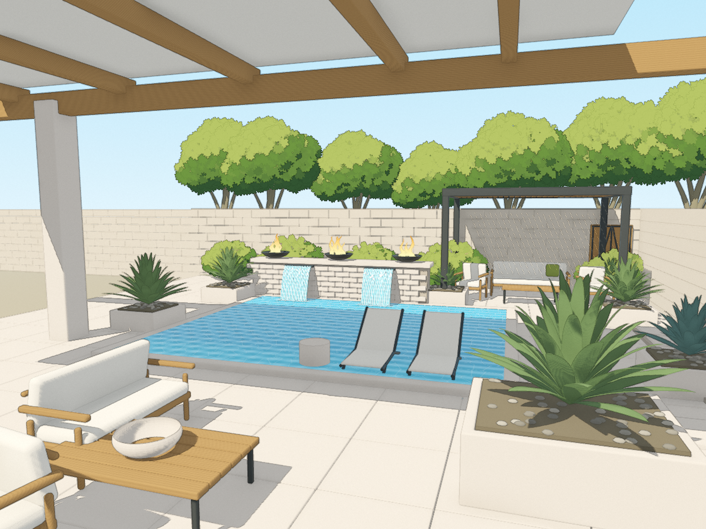

# Blender–Godot Astra Lab

A backyard courtyard study authored in Blender and rendered in Godot. The target is a clean architectural illustration: warm limestone and timber, a turquoise pool, twin sheers, fire bowls, a furnished pergola, and readable planting.

**Godot is the final rendering target. This remains a draft visual study, not an approved reference match or an Android performance benchmark.**

## New: anime-inspired foliage study

Seven broadleaf trees and five flowering shrub mounds now use authored three-dimensional crowns, curved tapered branches, small foliage brushes and grouped shading. The complete tree does not billboard. Only its small brush elements face the camera around fixed 3D centers.



[Tree close-up](docs/previews/anime-trees.png) · [Shrub close-up](docs/previews/anime-shrubs.png) · [Technique, primary tutorial sources and limits](docs/ANIME_FOLIAGE.md)

The generated GLB, original atlas, editable Blender source and these actual screenshots are **committed to this branch**, not available only as expiring CI artifacts. Asset publication commit: `cf4f899014f9740490352d7e6141a7e56d53d4b9`.

### Open the new foliage scene

Use **Godot 4.7.1 with Forward+**, import `godot/project.godot`, then open **`godot/courtyard_anime.tscn` and press F6**. Blender is not needed just to run the committed scene. From a terminal after resource import:

```sh
godot --path godot --scene res://courtyard_anime.tscn
```

**F5 still runs the original saved courtyard** so the reference remains available. `godot/courtyard.tscn` builds the original GLB-based scene; `godot/courtyard_editable.tscn` is the original saved scene. No baseline image or original authoring asset was overwritten.

### What actually ran

Linux review [33948853127](https://github.com/CRisdon45/Blender-Godot-Astra-Lab/actions/runs/33948853127) built source commit `297af30a2d611dbf4437fcafba34770a5be3e731` with **Blender 5.2.1 LTS** and rendered with **Godot 4.7.1 / Forward+ / software Vulkan**.

- Blender build and independent GLB stream validation passed.
- Godot capture completed without logged capture errors: **20 actual PNGs**, comprising four matched before/after views and twelve isolated-tree orbit angles.
- All **12 foliage surfaces and 14,300 card triangles** passed the imported card-center checks. A second local GLB check passed; maximum reconstructed-center error was approximately 0.0000011 scene units.
- All original `.blend`, GLB, saved-scene and tracked baseline-image hashes were preserved.
- **111 existing Python tests passed in that Linux run. 117 tests passed locally** after adding six focused source regressions. Source tests are not artistic acceptance.

**The overall rendering workflow is still diagnostic, not green:** editor import continues to report the existing popup-parenting errors. Those errors are retained in `runner-report.json` and `import.log`; they were not filtered out. The separate publication job only published the inspected, hash-pinned artifact and did not waive capture or geometry failures. Its success is not a clean import/production approval.

The first foliage run found a script-initialization error. The next run produced bad texture-coordinate/color data and visibly square cards; the geometry check rejected it. Custom-data-layer writing and UV selection were corrected, exported attributes were checked independently, and the screenshots above are from the subsequent passing capture, not those failed attempts.

These are generic broadleaf / flowering-mound studies. Species-specific architecture, wind, LOD transitions, editable-sun linkage, target-device performance and final art approval remain unfinished. The Blender file is editable and includes the packed atlas, but the live per-brush camera-facing transform is implemented in Godot, not in Blender's material preview.

## Controls

| Control | Action |
| --- | --- |
| Right mouse drag | Orbit with pole limits |
| Mouse wheel | Bounded zoom |
| R | Reset the reference camera |
| I | Toggle contours and illustration finish |
| W | Toggle falling water and its pool impact response |
| 1–6 | Reference, left, right, elevated, close and reverse views |
| F12 | Save a capture and metadata under `user://reviews` |

Some inherited camera presets have foreground obstructions. The foliage capture harness uses separate review compositions.

## Author and rebuild the foliage study

From the repository root, using Blender 5.2.1 and Godot 4.7.1:

```sh
blender --background --factory-startup --python-exit-code 1 --python tools/build_anime_foliage.py
python tools/check_foliage_glb.py godot/assets/anime/courtyard_anime.glb
godot --headless --audio-driver Dummy --path godot --editor --import
godot --path godot --scene res://courtyard_anime.tscn
```

This writes `authoring/courtyard_anime.blend` and `godot/assets/anime/`. The original `pool_godot_source.blend` is read-only input. See [the foliage notes](docs/ANIME_FOLIAGE.md) for the export contract and primary inspiration. No downloaded artist asset pack or runtime AI service is required.

## Original scene acceptance runner

```sh
python -m unittest discover -s tests -v
python tools/review.py --godot "PATH_TO_GODOT_EXECUTABLE" --scene both
```

On Windows, use the Godot `_console.exe` executable. This original-scene runner imports assets, runs navigation/water/real-scene tests, then requests six views with illustration and water toggles: 24 images per entry point, 48 for `both`. `--tests-only`, `--water on`, `--water off` and `--output` are supported. It does not regenerate Blender geometry or overwrite baseline captures.

The separate `.github/workflows/anime-foliage-review.yml` builds and captures the foliage study. Both workflows record failures rather than trusting exit zero. PNG checks validate actual compressed image data and checksums. Neither source checks nor capture completeness establish artistic acceptance. Original saved-scene shutdown diagnostics from the earlier Linux review are not resolved by this foliage pass.

See [acceptance gate notes](docs/ACCEPTANCE_GATE.md), [navigation/review history](docs/REVIEW_PASS.md), [water interaction notes](docs/WATER_INTERACTION_PASS.md), and [foliage notes](docs/ANIME_FOLIAGE.md).

## Original baseline and full regeneration

[Original Godot baseline](godot/captures/godot_courtyard.png) · [Earlier Blender preview](pool_recreation.png)

`build_scene.py`, `refine_scene.py` and `export_godot.py` are the original reconstruction pipeline. Running that pipeline or using `--save-editable` can replace original authoring/export/saved-scene files, so preserve manual edits before doing a full regeneration. The foliage build does not require those destructive steps.

The original layout and obscured areas were inferred from a supplied image. The source reference image is not bundled. Water, flames and foliage shading are stylized representations, not fluid, combustion or botanical simulations. Software-renderer timings are not evidence of desktop-GPU or Android performance.
