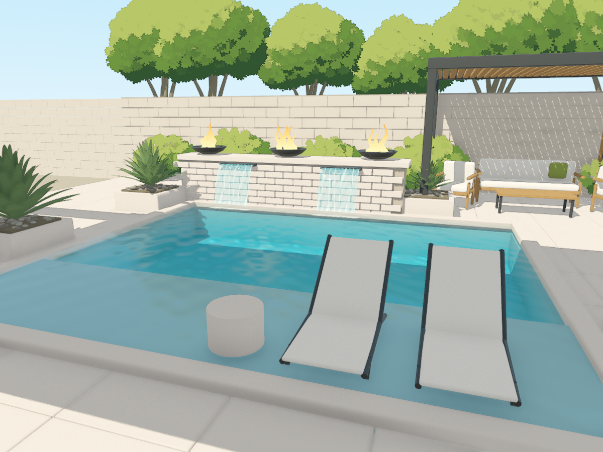

# Hero water study: actual visual review

## Status

**Optical foundation improved; artistic approval is NOT granted.** The water is
not yet the project-quality star Cody requested. Keep this study opt-in. Do not
replace the original or approved foliage scene merely because its code runs.

The illustrated environment direction and the separate, higher water standard
are recorded in `AGENTS.md` and [the research ledger](STYLE_DIRECTION_AND_WATER.md).

## Reproduce

With Godot 4.7.1 / Forward+, open `godot/courtyard_hero_water.tscn` and press F6.
W toggles feature flow, N toggles the lighting study; original F5 is unchanged.

```sh
godot --headless --audio-driver Dummy --path godot --editor --import
godot --headless --audio-driver Dummy --path godot --script res://tests/test_hero_preflight.gd
godot --path godot --scene res://courtyard_hero_water.tscn
```

The first command still reports the known editor popup-parenting errors. Do not
interpret exit zero alone as a clean import. The bounded Linux workflow retains
these errors in its report even when it proceeds to gather diagnostic images.

## Inspected execution

- Rendered source: `d6f52fc6e6c2dfdee56d76aeb6c2dbcd185a27e5`.
- Linux run: [33970201961](https://github.com/CRisdon45/Blender-Godot-Astra-Lab/actions/runs/33970201961).
- Artifact: `9970760035`, `hero-water-review-3`.
- Artifact SHA-256: `32cc172a673f2e60adeb59a3ce758b6776fa9a0afb2f4056f675eb693c0cec30`.
- Godot `4.7.1.stable.official.a13da4feb`, Forward+, Vulkan / llvmpipe software renderer.
- **130 Python source/math tests passed** both locally and in the Linux job.
- Actual-script preflight passed. The capture finished with **28 PNGs and zero
  runtime-contract errors**. No script or shader errors were logged by capture.
- Independent local verification decoded all 28 PNGs at 1200 x 900, verified five
  matched camera/aim/time pairs, and matched the six changed render/test/workflow
  files byte-for-byte against the captured source archive.
- Flow-off and two sheet-contact bindings passed. Eight sampled phases changed a
  manually chosen unobstructed water region, not merely the fire or background.
- Original anime GLB, original saved scene and original water shader hashes passed
  preservation checks. The runner left no tracked-source diff.

**The overall workflow is still diagnostic, not green.** Import reports
`Attempting to parent and popup a dialog that already has a parent.` Capture
shutdown reports **seven leaked Texture RIDs**. They remain unresolved and are
not removed from the evidence. Screenshots and source checks do not certify
Android or desktop-GPU performance, memory behavior, or final artistic quality.

The first attempt (`2600495`, run `33968637217`) failed to load the new scene
because of the incorrect `ReflectionProbe3D` class name and produced only four
old-scene images before timeout. The corrected `6ba85a6` run produced 20 actual
water-study frames. The 28-image refinement above is from `d6f52fc`, not either
earlier attempt. The actual-script preflight now catches this class of error
before the expensive visual capture.

## Visual evidence

These are actual Godot viewport images, not generated mockups. The five previews
are published separately from the original baselines with hash-pinned provenance.



[Matched original water](previews/hero-water-before.png) ·
[Sheet close-up](previews/hero-water-sheer.png) ·
[Night-lighting study](previews/hero-water-night.png) ·
[Measured-depth diagnostic, not a beauty view](previews/hero-water-depth.png) ·
[Publication provenance](previews/hero-water-provenance.json)

The complete artifact includes five before/after views, flow-off, depth, two
alternate recipes, transmission/reflection/receiver diagnostics, a receiver with
caustics disabled, two night studies, and eight fixed-camera water phases. The
Actions artifact expires after seven days; the selected published previews and
provenance remain in the branch. A separate chat review bundle holds the full set.

## What the frames actually establish

The new scene reveals the existing shallow shelf and deeper basin instead of
painting the same surface pattern over both. Refraction/absorption, a local
reflection probe, receiver-space caustics and softer transparent sheets can now
be inspected independently. The shared clock and geometry-derived full-width
contacts remain active.

The first optical run was too bumpy and repetitive. The refinement reduces
surface-normal strength and adjusts transmission, plaster color and caustic
strength. The resulting view is calmer, but the shelf is still visually flat,
the water lacks the final richness, and the sheet geometry still reads as a rigid
curtain at close range. This is progress in the optical foundation, not a claim
that the current beauty view is superior in every respect to the original.

The component views narrow the repeated-oval problem: the distorted reflection
pass carries the conspicuous pattern, while the transmitted-only view is much
cleaner. This is a visual diagnosis, not a mathematically exact image separation.
The receiver caustics toggle produces a separate measurable change in a water-only
region; it does not account for the dominant repeating reflected shapes.

Night changes are a lighting test, not finished nighttime art direction. Painted
foliage dims and restores correctly, and the study pool lights are restricted to
the basin/water layers. They do not model real fixtures, full light transport,
underwater-light caustics or fire illumination.

## Next artistic priorities

1. Replace the obvious repeating reflected distortion with calmer, less periodic
   water motion and more stable, recognizable surroundings. Evaluate a proper
   planar-reflection study against the current probe; do not assume it is free
   on Android or already implemented.
2. Restore luminous, attractive underwater light patterns without returning to a
   bright texture pasted across the surface. Keep caustics on lit receivers and
   maintain legible finish, shelf, steps and depth.
3. Refine the sheers' edge breakup, falling-film detail and landing aeration;
   broaden feature support only after this close-up reads convincingly.
4. Add a calibrated pool test fixture with representative shelf/step/deep-end
   dimensions, finishes, lighting and a camera orbit. The preserved source shelf
   is only about 5.25 cm under water and its flat basin about 95.25 cm; those are
   source-model limitations, not design standards or newly chosen pool depths.
5. Resolve import/shutdown diagnostics and measure target-device frame pacing,
   memory and GPU cost before promoting this study.

Surface shading amplitude is independently art-directed even though the ripple
phase/spectrum is shared with the simplified caustic approximation. Screen-space
refraction cannot show absent off-screen geometry; a once-captured box-projected
probe is not an exact dynamic planar reflection. Eight sampled motion frames do
not establish smooth live performance or constitute a seamless animation loop.
